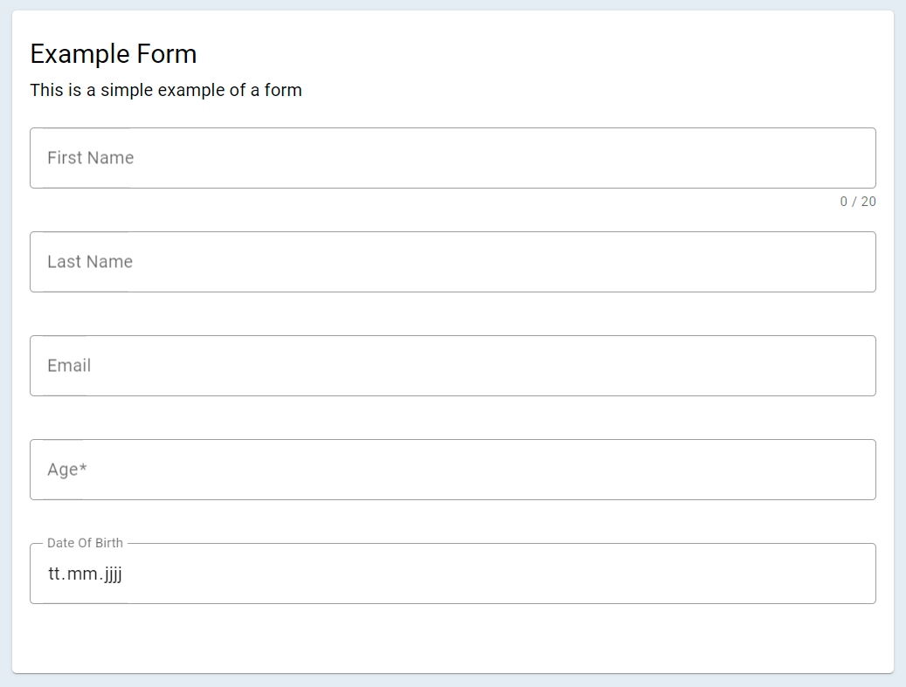

# Schema

The schema, which is passed to the JsonForm svelte component, describes the individual input elements of a form and is just a regular JSON object.

    {
        "title": "Example Form",
        "subtitle": "This is a simple example of a form",
        "fields": [
            {
                "key": "firstName",
                "type": "text",
                "maxLength": 20
            },
            {
                "key": "lastName",
                "label": "Last Name",
                "type": "text"
            },
            {
                "key": "email",
                "type": "email"
            },
            {
                "key": "age",
                "type": "number",
                "required": true
            },
            {
                "key": "dateOfBirth",
                "type": "date"
            }
        ]
    }

This schema results in the following form.

## Schema Configuration

### `title (string)`

An optional title of the form, which is displayed at the top.

#### Example

    "title": "Example Form"

### `subtitle (string)`

An optional subtitle of the form. The subtitle is displayed right under the title.

#### Example

    "subtitle": "This is a simple example of a form"

### `fields`

Fields make up the input fields of the form.

!> **Important** The following properties apply to every type of input field. The properties `key` and `type` are required.

| Key Name | Value Type | Required | Description                           |
| -------- | ---------- | -------- | ------------------------------------- |
| `key`    | string     | yes      | Unique name of the input field        |
| `type`   | string     | yes      | Type of the input field               |
| `label`  | string     | no       | An optional label for the input field |

?> **Info** Available input types are listed below.

#### Example

    "fields": [
        {
            "key": "firstName",
            "type": "text",
            "maxLength": 20
        },
        {
            "key": "lastName",
            "label": "Last Name",
            "type": "text"
        }
    ]

#### Type `text`

Text specific properties:

| Key Name    | Value Type | Required | Description                                                                                                                          |
| ----------- | ---------- | -------- | ------------------------------------------------------------------------------------------------------------------------------------ |
| `maxLength` | integer    | no       | Maximum character length of the input field                                                                                          |
| `variant`   | string     | no       | "outlined" \| "filled" \| "standard"                                                                                                 |
| `icon`      | string     | no       | The icon appears next to an input field. Available icons can be found [here](https://fonts.google.com/icons?selected=Material+Icons) |

#### Type `textarea`

Textarea specific properties:

| Key Name    | Value Type | Required | Description                                 |
| ----------- | ---------- | -------- | ------------------------------------------- |
| `maxLength` | integer    | no       | Maximum character length of the input field |

#### Type `email`

Email specific properties:

| Key Name    | Value Type | Required | Description                                                                                                                          |
| ----------- | ---------- | -------- | ------------------------------------------------------------------------------------------------------------------------------------ |
| `maxLength` | integer    | no       | Maximum character length of the input field                                                                                          |
| `variant`   | string     | no       | "outlined" \| "filled" \| "standard"                                                                                                 |
| `icon`      | string     | no       | The icon appears next to an input field. Available icons can be found [here](https://fonts.google.com/icons?selected=Material+Icons) |

#### Type `number`

Number specific properties:

| Key Name  | Value Type | Required | Description                                                                                                                          |
| --------- | ---------- | -------- | ------------------------------------------------------------------------------------------------------------------------------------ |
| `variant` | string     | no       | "outlined" \| "filled" \| "standard"                                                                                                 |
| `icon`    | string     | no       | The icon appears next to an input field. Available icons can be found [here](https://fonts.google.com/icons?selected=Material+Icons) |

#### Type `date`

Date specific properties:

| Key Name  | Value Type | Required | Description                                                                                                                          |
| --------- | ---------- | -------- | ------------------------------------------------------------------------------------------------------------------------------------ |
| `variant` | string     | no       | "outlined" \| "filled" \| "standard"                                                                                                 |
| `icon`    | string     | no       | The icon appears next to an input field. Available icons can be found [here](https://fonts.google.com/icons?selected=Material+Icons) |